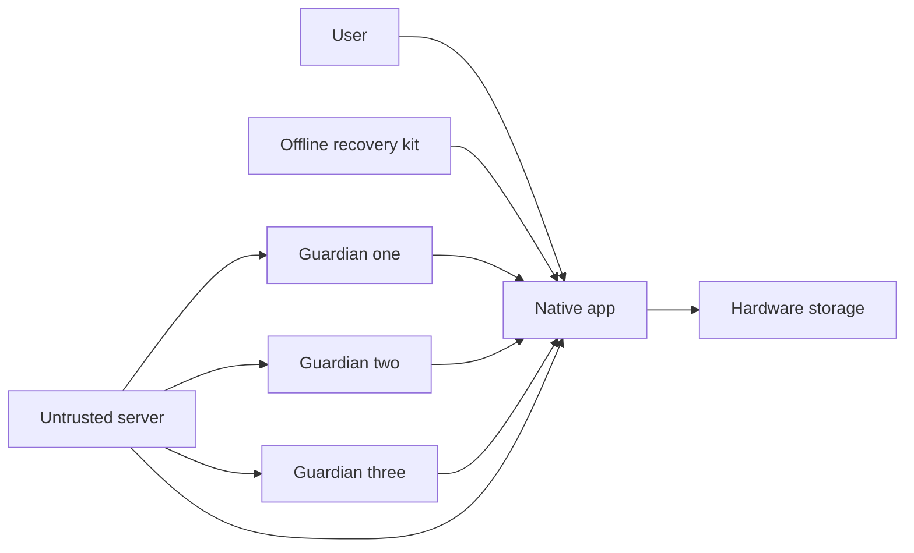

# E5 native wallet recovery threat model

## Executive summary

The highest risks are recovery-secret disclosure, guardian collusion or social
engineering, rollback to an old recovery state, and a compromised server trying
to turn coordination into custody. The design therefore keeps an offline
user-held seed path, adds a separate 2-of-3 guardian path, and makes the server
incapable of holding a share or overriding recovery. This is a design-only
model: no chain, cryptography, mobile SDK or production implementation exists.

## Scope and assumptions

In scope: `relay/core/e5_key_boundary.py`, `relay/core/e5_signing_consent.py`,
`relay/core/e5_authenticator_evidence.py`, `relay/core/e5_recovery_policy.py`
and their E5 tests. Runtime exchange services, current payout signing, E3 CEX
execution, CI and deployment are out of scope.

Confirmed assumptions: a user-held seed is permitted; a second recovery route
should use independent trusted participants/devices; the remote server is
untrusted for signing and recovery. The target is a future consumer native app.

Open questions that can change risk ranking: supported mobile platforms and
hardware guarantees; chosen chain/key scheme; whether guardians are devices,
people, or both; regulatory and support obligations by launch geography.

## System model

### Primary components

- Native app displays intent and coordinates local user interaction.
- Hardware-backed storage owns a non-exportable signing key.
- Offline recovery kit is controlled solely by the user.
- Three independent guardian domains provide a 2-of-3 alternative path.
- Remote server may relay opaque coordination messages but cannot hold a share,
  read the seed, override policy or sign.

### Data flows and trust boundaries

- User → native app: consent and recovery choice; local UI boundary with explicit confirmation.
- Native app → hardware storage: local authorization request; no key export.
- Offline kit → new device: seed entered locally; never sent to the server.
- Guardians → new device: threshold approvals; distinct trust domains, single-use and delayed.
- Server ↔ native app/guardians: opaque coordination and notifications; no secret or recovery share.

#### Diagram

## Assets and security objectives

| Asset | Why it matters | Security objective (C/I/A) |
|---|---|---|
| Device signing key | Controls user funds | C/I |
| Offline seed | Can recreate wallet authority | C/I/A |
| Guardian shares/approvals | Alternative recovery authority | C/I/A |
| Recovery epoch and revocations | Prevent old devices/backups regaining control | I/A |
| Display and consent binding | Prevents signing a different transaction | I |
| App build and recovery protocol | Compromise can subvert every control | I/A |

## Attacker model

### Capabilities

- Remote attacker may compromise the coordination server or network path.
- Phisher may impersonate support and target users or guardians.
- Thief may possess a locked old or new device.
- Malicious guardian may collude with one other guardian.
- Supply-chain attacker may try to replace the native application build.

### Non-capabilities

- No assumed break of hardware-backed key isolation or approved cryptography.
- No physical coercion defense is claimed.
- No production endpoints, recovery shares or live wallet exist in this scope.

## Entry points and attack surfaces

| Surface | How reached | Trust boundary | Notes | Evidence |
|---|---|---|---|---|
| Signing display | Native UI input | User → app | Synthetic-only canonical fields | `relay/core/e5_signing_consent.py` |
| Authenticator evidence | Local assertion | App → authenticator | Fresh counter-bound evidence only | `relay/core/e5_authenticator_evidence.py` |
| Offline recovery | User enters seed locally | Offline kit → device | Server receipt forbidden | `relay/core/e5_recovery_policy.py` |
| Guardian recovery | Two independent approvals | Guardians → device | 2-of-3, delayed, single-use | `relay/core/e5_recovery_policy.py` |
| Coordination server | Future opaque relay | Server → devices | Untrusted; cannot sign or recover | `relay/core/e5_key_boundary.py` |

## Top abuse paths

1. Phisher impersonates support → asks for seed → user discloses it → wallet takeover.
2. Server compromise → attacker rewrites recovery target → guardians approve wrong device → takeover.
3. Two guardians collude → satisfy threshold → replace the user's active device → takeover.
4. Attacker restores an old backup → lowers recovery epoch → revoked device regains authority.
5. Malware alters displayed destination → user consents → different preimage is signed.
6. Supply-chain attacker ships modified app → captures seed during restore → all funds exposed.
7. User loses seed and guardian availability → recovery cannot complete → permanent loss of access.

## Threat model table

| Threat ID | Threat source | Prerequisites | Threat action | Impact | Impacted assets | Existing controls (evidence) | Gaps | Recommended mitigations | Detection ideas | Likelihood | Impact severity | Priority |
|---|---|---|---|---|---|---|---|---|---|---|---|---|
| TM-001 | Phisher/malware | User begins seed restore | Exfiltrate seed | Full wallet takeover | Seed, funds | Server receipt and plaintext cloud backup forbidden (`e5_recovery_policy.py`) | No hardened restore UI exists | Local-only restore, screenshot/clipboard denial where feasible, explicit anti-support warning, independent restore test | Local privacy-safe restore anomaly counters | high | high | critical |
| TM-002 | Compromised server | Guardian flow relies on server messages | Substitute target device or approvals | Wallet takeover | Guardian authority, funds | Server cannot hold share or override (`e5_recovery_policy.py`) | Formal authenticated protocol absent | End-to-end bind approvals to wallet, new device key, epoch and expiry; verify on guardian displays | Alert all devices/guardians on initiation and target changes | medium | high | high |
| TM-003 | Colluding guardians | Two guardian domains compromised | Satisfy 2-of-3 threshold | Wallet takeover | Guardian shares, funds | Three independent domains and 24h delay (`e5_recovery_policy.py`) | Independence is currently declarative | Require heterogeneous domains; active-device veto; configurable longer delay for high value | Collusion and correlated-device telemetry without identities | medium | high | high |
| TM-004 | Backup attacker | Old valid backup is available | Roll recovery state backward | Revoked authority returns | Epoch, revocations | Monotonic epoch and old-backup denial required (`e5_recovery_policy.py`) | Durable epoch mechanism undecided | Bind epoch into signed recovery state and reject lower epochs across devices/guardians | Log rejected stale epochs and repeated attempts | medium | high | high |
| TM-005 | Supply-chain attacker | Build/update channel compromised | Capture seed or alter recovery logic | Systemic wallet theft | Seed, build integrity | Build provenance required but unimplemented (`e5_key_boundary.py`) | No reproducible signed mobile build | Reproducible builds, two-person release, pinned dependencies, platform signature verification | Independent artifact transparency and hash monitoring | low | high | high |
| TM-006 | Device malware | Malware controls UI process | Change destination/display binding | Unauthorized transfer | Consent, funds | Payload/display hashes and separate consent (`e5_signing_consent.py`) | Trusted display not selected | Reconstruct display from signed preimage inside trusted native boundary | Compare signed transaction to receipt before broadcast | medium | high | high |
| TM-007 | Availability attacker or user error | Seed lost and guardians unavailable | Prevent threshold completion | Permanent loss of access | Availability of funds | Two independent recovery paths (`e5_recovery_policy.py`) | Guardian lifecycle not designed | Periodic private recovery rehearsal, guardian health rotation, documented inheritance plan | Local reminders and guardian availability checks | medium | high | high |

## Criticality calibration

- Critical: likely direct loss at user or fleet scale, such as seed phishing or a production restore path sending the seed to a server.
- High: wallet takeover requiring server compromise, two guardians, rollback, malicious build, or UI compromise; permanent recovery denial also qualifies.
- Medium: targeted recovery disruption with a safe alternate path, privacy leakage without signing authority, or noisy guardian spam contained by delays.
- Low: design-only metadata issues with no secret, authority, production path or durable availability impact.

## Focus paths for security review

| Path | Why it matters | Related Threat IDs |
|---|---|---|
| `relay/core/e5_key_boundary.py` | Defines the non-custodial trust invariant | TM-002, TM-005 |
| `relay/core/e5_signing_consent.py` | Binds user-visible intent to unsigned bytes | TM-006 |
| `relay/core/e5_authenticator_evidence.py` | Defines freshness and replay expectations | TM-006 |
| `relay/core/e5_recovery_policy.py` | Defines both recovery paths and rollback controls | TM-001, TM-002, TM-003, TM-004, TM-007 |
| `relay/core/e5_recovery_attempt.py` | Enforces target/epoch binding, threshold, delay, veto and terminal outcomes | TM-002, TM-003, TM-004, TM-007 |
| `tests/test_e5_recovery_policy.py` | Must prevent capability and custody drift | TM-001–TM-007 |

Quality check: all discovered E5 design entry points and trust boundaries are
covered; runtime and future design are separated; user decisions about seed and
guardians are reflected. Platform, chain, protocol and guardian composition
remain explicit open questions.
