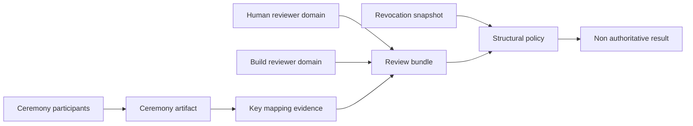

## Executive summary

The highest-risk failure is false independence: two reviewer accounts may appear
separate while sharing one administrative, recovery or CI root, allowing one
compromise to authorize a malicious checkpoint key set. Replay, revocation
rollback and build-pipeline substitution are the next material risks. Current
controls are deliberately offline and non-authoritative; no reviewer credential
or runtime verifier exists, so present production exploitability is low, while
future activation impact would be high.

## Scope and assumptions

- In scope: `native-wallet/`, ADRs 0002–0007, and checkpoint reviewer/key-set
  test contracts.
- Out of scope: production deployment, real credentials, mobile SDK selection,
  server APIs, transaction signing and broader wallet recovery.
- Confirmed: reviewers belong to independent administrative domains with
  independent credential and recovery roots, not merely separate accounts.
- Assumed future usage: offline ceremony artifacts are transferred to a local
  verifier; at most one reviewer is automated.
- Open question: which concrete credential technologies and revocation channels
  will represent each trust domain. This blocks activation, not this model.

## System model

### Primary components

- Ceremony proposal and lifecycle records: content-bound but non-executing
  structures (`native-wallet/crates/wallet-core/src/lib.rs`,
  `TrustKeyCeremonyRequest`, `review_key_lifecycle`).
- Key mapping evidence: test-only signer-slot to x-only-key mapping
  (`native-wallet/crates/wallet-core/tests/checkpoint_keyset_evidence.rs`).
- Review bundle: binds ceremony, mapping and algorithm-selection digests
  (`checkpoint_keyset_review_acceptance.rs`).
- Reviewer policy: structural freshness, replay and revocation checks
  (`checkpoint_reviewer_policy.rs`).
- Future credential verifier and trust-root store: intentionally absent.

### Data flows and trust boundaries

- Ceremony participants → offline artifact: key IDs, commitments and transcripts;
  content hashes only, with no authenticated transport currently specified.
- Mapping reviewers → review bundle: reviewer/domain IDs and attestation hashes;
  length/schema checks exist, cryptographic reviewer authentication does not.
- Independent trust domains → future verifier: credentials and revocation state;
  policy requires separate admin/recovery roots, but no implementation exists.
- CI reviewer → bundle: reproducible-build evidence; limited to one automated
  reviewer so CI compromise alone cannot satisfy two-domain policy.
- Bundle → wallet trust decision: currently no edge exists; all test outcomes
  keep key installation and checkpoint trust false.

#### Diagram

## Assets and security objectives

| Asset | Why it matters | Security objective (C/I/A) |
|---|---|---|
| Reviewer credential roots | Compromise can counterfeit approval | C/I |
| Domain independence | Prevents one control plane satisfying quorum | I |
| Ceremony and mapping digests | Bind exact signer slots and keys | I |
| Revocation epoch/snapshot | Prevents revoked roots returning | I/A |
| Evidence IDs/challenges | Prevent replay across bundles | I |
| Build provenance | Prevents CI from substituting reviewed artifacts | I/A |

## Attacker model

### Capabilities

- Compromise one reviewer device, CI identity or recovery account.
- Copy, delay, reorder or replay offline artifacts.
- Substitute bundle fields before content validation.
- Attempt revocation-state rollback or domain-label impersonation.

### Non-capabilities

- The attacker does not initially control two truly independent domains.
- No runtime verifier, production trust store or key-install path currently
  exists (`verifier_enabled: false` in `wallet-core/src/lib.rs`).
- Hash collision or BIP340 break is not assumed.

## Entry points and attack surfaces

| Surface | How reached | Trust boundary | Notes | Evidence (repo path / symbol) |
|---|---|---|---|---|
| Ceremony artifact | Offline import | Participants → artifact | Parallel sets do not prove ID/key mapping | `wallet-core/src/lib.rs:TrustKeyCeremonyRequest` |
| Mapping evidence | Offline import | Reviewer → mapping | Parses x-only keys; reviewers unverified | `checkpoint_keyset_evidence.rs:review` |
| Acceptance bundle | Offline import | Domains → bundle | Hash claims are not attestations | `checkpoint_keyset_review_acceptance.rs:review` |
| Revocation snapshot | Future local input | Authority → policy | Monotonicity required; source absent | `checkpoint_reviewer_policy.rs:review` |
| CI provenance | Future artifact | CI → reviewer | One automated reviewer maximum | `checkpoint_reviewer_policy.rs:Attestation` |

## Top abuse paths

1. Compromise shared recovery authority → impersonate two nominal reviewer
   accounts → satisfy apparent quorum → introduce attacker checkpoint keys.
2. Capture valid attestation → replay evidence ID against a different session →
   bypass fresh human review → reuse stale approval.
3. Supply old revocation snapshot → resurrect revoked reviewer root → approve a
   malicious mapping.
4. Compromise CI → alter mapping/bundle and automated attestation → seek a second
   weakly separated CI reviewer → counterfeit independence.
5. Permute key commitments across signer IDs → exploit old parallel-list
   ambiguity → redirect signer authority; mapping digest now detects this.
6. Substitute domain labels without authenticated domain roots → claim two
   domains controlled by one attacker → false quorum.

## Threat model table

| Threat ID | Threat source | Prerequisites | Threat action | Impact | Impacted assets | Existing controls (evidence) | Gaps | Recommended mitigations | Detection ideas | Likelihood | Impact severity | Priority |
|---|---|---|---|---|---|---|---|---|---|---|---|---|
| TM-001 | Reviewer/admin attacker | Shared IAM or recovery root | Masquerade as two domains | Malicious key set accepted | Domain independence, roots | Distinct domain/root/recovery checks (`checkpoint_reviewer_policy.rs`) | Roots are claims only | Require separately administered roots and documented recovery ownership | Alert on reused root/recovery fingerprints | medium | high | high |
| TM-002 | Artifact thief | Prior valid evidence | Replay evidence or challenge | Stale approval reused | Evidence IDs, bundle | 10-minute lifetime and consumed-ID check (`checkpoint_reviewer_policy.rs`) | Durable replay ledger absent | Atomic single-use ledger bound to bundle and epoch | Log duplicate evidence IDs | medium | high | high |
| TM-003 | Revoked reviewer | Access to old snapshot | Roll revocation epoch backward | Revoked root regains authority | Revocation state | Minimum monotonic epoch check (`checkpoint_reviewer_policy.rs`) | Trusted snapshot distribution absent | Signed monotonic snapshots from independent revocation roots | Alert on epoch regression | medium | high | high |
| TM-004 | CI attacker | Controls automated reviewer | Substitute build/mapping artifact | Supply attacker-controlled evidence | Build provenance, mapping | At most one automated reviewer; distinct domains (`ADR 0007`) | Reproducible-build verifier absent | Two-party reproducible comparison; human second domain | Compare artifact hashes across builders | medium | high | high |
| TM-005 | Artifact manipulator | Can edit offline bundle | Change ceremony/mapping/epoch | Review binds wrong object | Ceremony and mapping integrity | Exact digest binding and canonical encoding (`ADR 0006`) | Transfer authenticity absent | Authenticated removable-media workflow and independent display verification | Log every rejected digest mismatch | low | high | medium |
| TM-006 | Insider | Controls reviewer metadata | Invent trust-domain labels | False independence | Domain identity | Allowlisted labels and role separation (`ADR 0006`) | Labels lack credential-root authentication | Bind domain ID into credential certificate/profile | Alert on new domain/root pairing | medium | high | high |
| TM-007 | Availability attacker | Blocks revocation/reviewer domain | Prevent fresh quorum | Key rotation stalls | Availability | No fail-open acceptance; authority remains false | Recovery SLA undefined | Document offline break-glass that still requires two roots | Monitor snapshot/review freshness | medium | medium | medium |

## Criticality calibration

- Critical: two-domain authentication bypass or arbitrary production trust-root
  installation; no current example is reachable because activation is absent.
- High: shared-root impersonation, replay, revocation rollback or CI plus weak
  reviewer separation that could authorize attacker keys after activation.
- Medium: artifact substitution caught by hashes, or targeted availability loss
  that blocks rotation without granting authority.
- Low: malformed offline input rejected before state change, or metadata leakage
  containing no credentials or private material.

## Focus paths for security review

| Path | Why it matters | Related Threat IDs |
|---|---|---|
| `native-wallet/crates/wallet-core/src/lib.rs` | Ceremony/lifecycle invariants and permanent false authority flags | TM-001, TM-003, TM-005 |
| `native-wallet/crates/wallet-core/tests/checkpoint_keyset_evidence.rs` | Resolves signer-to-key mapping ambiguity | TM-005 |
| `native-wallet/crates/wallet-core/tests/checkpoint_keyset_review_acceptance.rs` | Binds cross-domain review claims | TM-001, TM-006 |
| `native-wallet/crates/wallet-core/tests/checkpoint_reviewer_policy.rs` | Freshness, replay and revocation policy | TM-001–TM-004, TM-007 |
| `docs/adr/0005-active-checkpoint-keyset-evidence.md` | Documents the parallel-list mapping limitation | TM-005 |
| `docs/adr/0007-checkpoint-reviewer-identity-policy.md` | Defines independence and activation blockers | TM-001–TM-004, TM-006 |

## Quality check

- Covered all discovered offline entry points and trust boundaries.
- Separated current test/dev contracts from absent future runtime components.
- Reflected owner confirmation that administrative domains and roots are truly
  independent.
- Kept credential technology and revocation distribution as explicit blockers.
- Included mitigations and detection for every high-priority threat.
